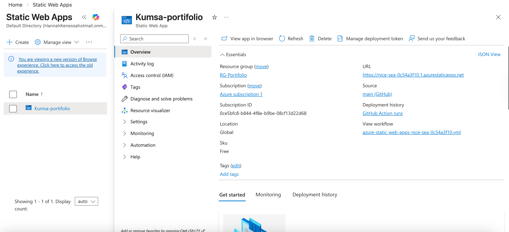

# Azure Admin Portfolio | Kumsa Etana Tolesa

## About Me
I am an energetic IT professional with hands-on experience in Microsoft Azure, networking, and system administration. I am passionate about cloud technologies, monitoring, and building secure, scalable environments, and I am currently preparing for the AZ-104 certification.

## Skills
- Azure Virtual Machines & VNets
- Network Security Groups (NSGs) & RBAC / Entra ID
- Monitoring & Logging (Azure Monitor)
- Cloud Operations & Resource Management
- Systems Administration & Security
- Networking & LAN Configuration
- Technical Support & Troubleshooting

## Live Demo
[View My Live Website](https://nice-sea-0c54a3f10.1.azurestaticapps.net)

## Project Proof

Workflow test: Thu Mar 26 16:21:23 CET 2026
